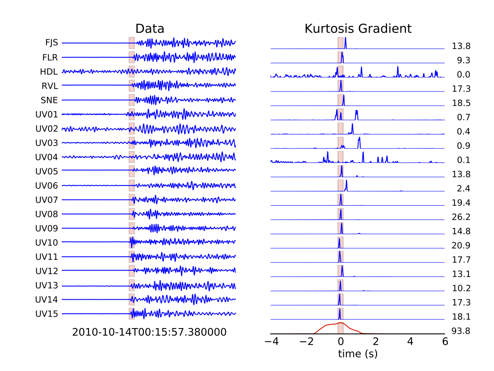

.. Tutorial for WaveLoc

===============
Getting Started
===============

This is a quick guide for getting started with WaveLoc.

Download and installation
=========================

You can download the latest distribution on the `waveloc downloads page  
<http://github.com/amaggi/waveloc/downloads>`_, or if you're feeling
courageous you can download the development version from github:
http://github.com/amaggi/waveloc.  

**System requirements** : 

* python 2.7, numpy >= 1.6.1, h5py >= 2.0.0 (all available through the 
  `Enthought python distribution
  <http://www.enthought.com/products/getepd.php>`_ version >= 7.2)  
* obspy > 0.7.1 (available here : http://obspy.org)
* NonLinLoc for time grid calculation (not strictly required)
* other stuff I've surelly fogotten about...

**Suggestion** : 

The easiest way to get all the required python modules (except
for obspy) is to install a recent version of the Enthought Python Distribution.
Their full distribution is free for academic use (it is temporarily unavailable
due to modification of their academic license, but should be back soon).  They
also bundle a completely free version, but it does not have all the necessary
modules (notably h5py). 

If you're not already using a full EPD distribution >= 7.2, you may be stuck
until EPD release their academic version again. You may of course
attempt to install all the required modules by hand, but this is recommended
only if you really enjoy python hacking.  Or if you know of another
distribution that works out-of-the-box, please share!!

Once you've installed the EPD python distribution, you should be able to
install the obspy modules by running ::

  easy_install -U obspy.core
  easy_install -U obspy.signal
  easy_install -U obspy.mseed

and so on for all the other obspy modules you may be interested in.

Installation
------------

Untar the distribution, then install in the usual Python manner : ::

  python setup.py install

If you want to use ``NonLinLoc`` to calculate the 3D time-grids, download it
from Anthony Lomax's website http://alomax.free.fr/nlloc/, and install it where
you prefer (you just need to be able to call ``Vel2Grid`` and ``Grid2Time``
correctly).

Running the examples
====================

In order to get you started running waveloc, we have prepared the following
example scripts : 

#. a synthetic example to verify the response of the recording network;
#. a real migration example.

You should find the relevant scripts in the ``examples`` directory in the
waveloc distribution.

* For the tests, temporarily set the environment variable ``$WAVELOC_PATH`` to
  the directory you would like the tests to run in. 

* Download the test data here : `test_data.tgz
  <https://github.com/downloads/amaggi/waveloc/test_data.tgz>`_ (beware : it is a
  large file !), and unpack the archive in the  ``$WAVELOC_PATH`` directory.

* Run the ``setup_examples.py`` script to set up the required directory structure
  for the examples: ::

    cd examples
    python setup_examples.py  

Running the synthetic test
--------------------------
Run the ``run_syn_example.py`` script to run the synthetic test.  The first time
you run the script it will take a long time, as the time grids need to be
interpolated.  After the run, you should the find the following figure in the
directory ``$WAVELOC_PATH/out/TEST_Dirac/fig``:
  
.. image:: figures/test_grid4D_hires.hdf5.png
  :width: 600px
  :align: center

You can test the effect of reducing the station coverage by uncommenting the
following line in the script and re-running the test. ::

  #uncomment remove some stations to test response for fewer stations
  #wo.opdict['sta_list']="FJS,FLR,FOR,HDL,RVL,SNE,UV01,UV02,UV03,UV04,UV05,UV06,UV07,UV08,UV09,UV10,UV11,UV12,UV13,UV14,UV15"

Running the migration test
--------------------------
Run the ``run_waveloc_example.py`` script to run the synthetic test.  The first
time you run the script it will take a long time, as the time grids need to be
interpolated.  After the run, you should the find the a file named
``locations.dat`` in the following directory
``$WAVELOC_PATH/out/TEST_fullRes/loc``.  The file should contain the following
lines, indicating that two events were found: ::

  Max = 93.83, 2010-10-14T00:15:57.380000 - 0.13 s + 0.17 s, x= 366.2417 pm 0.3505 km, y= 7650.5250 pm 0.1627 km, z= -0.5417 pm 0.4087 km
  Max = 70.13, 2010-10-14T00:17:13.830000 - 0.17 s + 0.17 s, x= 366.1324 pm 0.1940 km, y= 7650.6176 pm 0.1514 km, z= -0.6691 pm 0.5581 km

In the ``$WAVELOC_PATH/out/TEST_fullRes/loc`` you should find figures that look
like:

.. image:: figures/grid_2010-10-14T00:15:57.380000.png
  :width: 600px
  :align: center

and:

